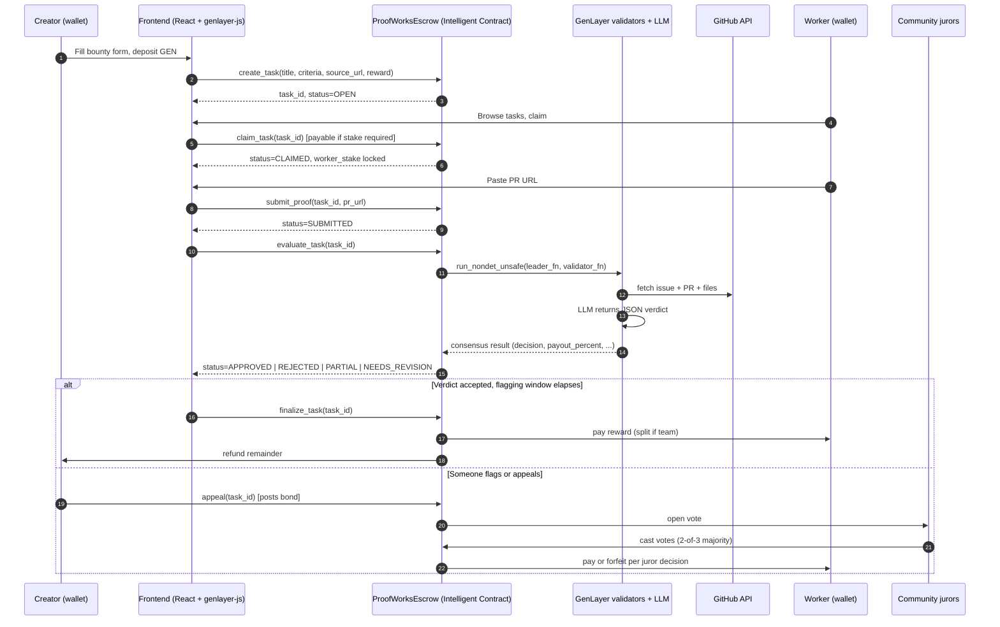
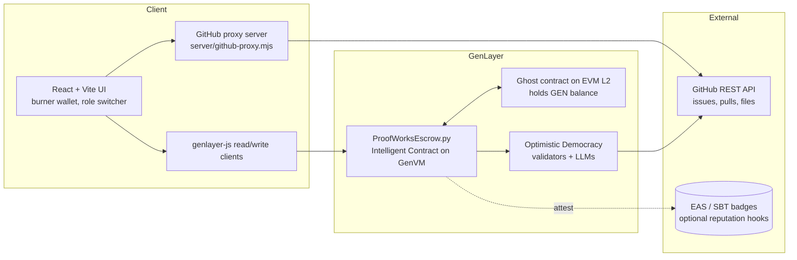
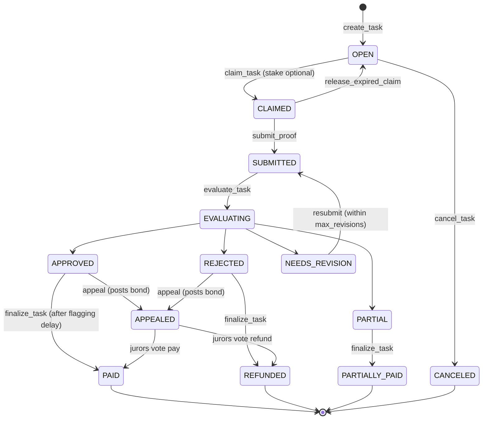

# ProofWorks architecture

This page is the picture-first companion to `spec.md`. If you want the full reasoning, read the spec. If you just want to see how the pieces fit, read this.

## End-to-end flow

## Component map

## Task state machine

## Why these components exist

The Intelligent Contract is the only place a verdict is allowed to live. The frontend can show one, the GitHub proxy can fetch evidence to display, but the actual decision that moves money is the consensus output from `run_nondet_unsafe`. That is the whole reason ProofWorks is built on GenLayer instead of Ethereum.

The ghost contract is GenLayer's standard mechanism for letting the IC hold and route GEN on the EVM layer. We do not need to think about it much, but it is what makes payouts work.

The GitHub proxy is a convenience for the UI, not the contract. Validators fetch GitHub directly inside the nondet block so the consensus result does not depend on a centralized server.
